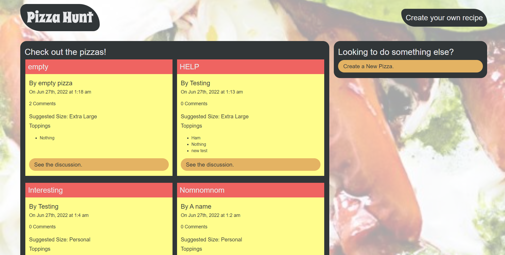

  # Pizza Hunt
  
  This application uses Express and MongoDB to allow users to create, share, and comment on different, custom pizza recipes.
  
  ## Table of Contents
  
  * [Installation](#installation)
  * [Built With](#built)
  * [Usage Information](#usage)
  * [Authors & Acknowledgements](#credits)
  * [Contact](#questions)

  ## Installation
  This application can be accessed using its deployed Heroku link.

  ## Built With
  * HTML
  * CSS
  * JavaScript
  * MongoDB
  * Mongoose
  * MongoDB Atlas
  * Heroku
  * Express
  * Node
  
  ## Usage Information
  [Pizza Hunt](https://vast-caverns-55476.herokuapp.com/) 
    
  This application is a pizza forum. 
    
    
  ## Authors & Acknowledgements
  
  © 2020 - 2022 Trilogy Education Services, a 2U, Inc. brand. All Rights Reserved.
  
  Made by [TOVTC](https://github.com/TOVTC).

  ## Questions?
  Contact repository author via [GitHub](https://github.com/TOVTC). 
    